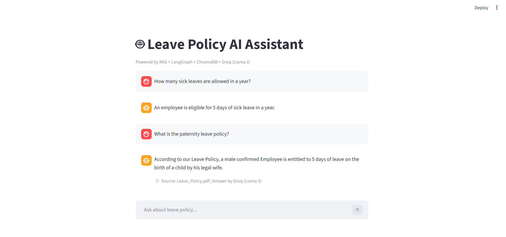

# Leave Policy AI Assistant

A RAG-based (Retrieval-Augmented Generation) chatbot built with **LangGraph**, **ChromaDB**, **Groq (Llama 3)**, and **Streamlit** that answers employee questions about the company's Leave Policy document.

---

# Features

- Reads and indexes a Leave Policy PDF automatically
- Retrieves the most relevant chunks using **TF-IDF + ChromaDB** vector search
- Re-ranks results using keyword-based scoring for better accuracy
- Extracts only relevant sentences from retrieved chunks (sentence-level filtering)
- Generates clean, concise answers using **Groq's Llama 3.1 (8B Instant)** model
- Falls back to Groq's general HR knowledge if the answer is not found in the PDF
- Simple and interactive chat UI built with **Streamlit**

---

## Architecture

```
User Question
     ↓
[LangGraph Workflow]
     ↓
[Retrieve Node]  →  TF-IDF vectorize query → ChromaDB similarity search → Top 5 chunks
     ↓
[Answer Node]
  ├── If relevant chunk found (score ≥ threshold):
  │       → Keyword re-ranking
  │       → Sentence-level filtering
  │       → Groq generates answer from context  (Source: PDF)
  └── If not found:
          → Groq answers from general HR knowledge  (Source: General)
     ↓
Answer displayed in Streamlit Chat UI
```

---

## Tech Stack

| Component       | Technology                                 |
| --------------- | ------------------------------------------ |
| UI              | Streamlit                                  |
| PDF Loader      | LangChain `PyPDFLoader`                    |
| Text Splitting  | LangChain `RecursiveCharacterTextSplitter` |
| Vectorization   | Scikit-learn `TfidfVectorizer`             |
| Vector Database | ChromaDB                                   |
| Workflow Engine | LangGraph                                  |
| LLM             | Groq — Llama 3.1 8B Instant                |

---

## Project Structure

```
Chatbot/
├── chatbot.py          # Main application file
├── clear_cache.py      # Utility to clear ChromaDB cache
├── Leave Policy.pdf    # Source document (company leave policy)
├── chroma_db/          # Auto-generated vector store (gitignored)
└── README.md           # Project documentation
```

---

## Setup & Installation

### 1. Clone the repository

```bash
git clone https://github.com/Anjali-Shrivastava624/leave-policy-chatbot.git
cd leave-policy-chatbot
git checkout feature/leave-policy-chatbot
```

### 2. Install dependencies

```bash
pip install streamlit langchain langchain-community langgraph chromadb groq scikit-learn pypdf
```

### 3. Set your Groq API Key

Get your free API key from [console.groq.com](https://console.groq.com)

Set it as an environment variable:

```bash
# Windows (PowerShell)
$env:GROQ_API_KEY = "your-api-key-here"

# Mac/Linux
export GROQ_API_KEY="your-api-key-here"
```

Or update directly in `chatbot.py`:

```python
GROQ_API_KEY = os.environ.get("GROQ_API_KEY", "your-api-key-here")
```

### 4. Update the PDF path

In `chatbot.py`, update this line to point to your PDF file:

```python
PDF_PATH = r"path\to\your\Leave Policy.pdf"
```

### 5. Run the app

```bash
streamlit run chatbot.py
```

---

## How It Works

1. **PDF Indexing**: On first run, the Leave Policy PDF is loaded, split into chunks of 600 characters (with 80-character overlap), and stored in ChromaDB using TF-IDF embeddings.

2. **Query Processing**: When a user asks a question, it is vectorized and the top 5 most similar chunks are retrieved from ChromaDB.

3. **Re-ranking**: Retrieved chunks are re-ranked based on keyword presence to ensure the most relevant chunk is used.

4. **Sentence Filtering**: Only the sentences within a chunk that contain query keywords are passed to the LLM — reducing noise.

5. **Answer Generation**: Groq's Llama 3.1 model generates a concise, policy-based answer from the filtered context.

6. **Fallback**: If no relevant content is found in the PDF (relevance score below threshold), Groq answers using general HR knowledge.

---

## 📸 Screenshot

> 

---

## Notes

- The `chroma_db/` folder is auto-generated and excluded from version control via `.gitignore`
- Never commit your actual Groq API key — use environment variables
- The PDF file is included in this repo for demo purposes only

---

## Author

**Anjali Shrivastava — Internal HR Tools**  
Built as part of an AI/ML internship project.
